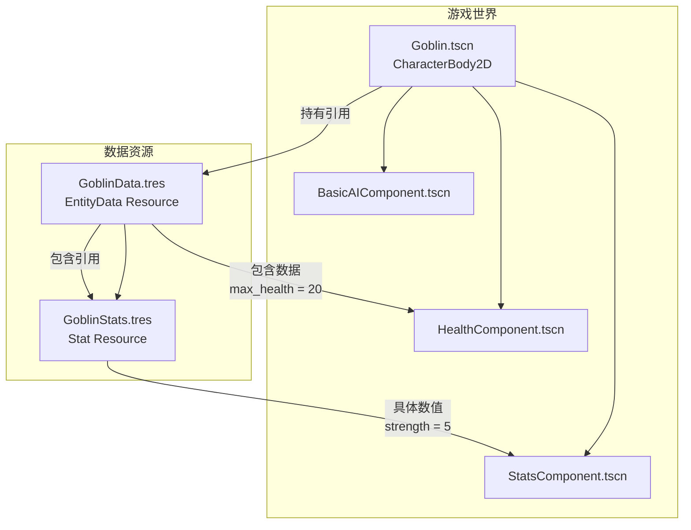

[&#8617; 返回总览](../README.md)

---

## 3. 实体与属性子系统

本节详细设计所有可交互对象（玩家、敌人、NPC等）的架构。设计的核心是采用灵活的、基于组件的模式，以充分发挥Godot引擎的优势。

### 3.1. `Entity` 蓝图：一种“Godot原生”的实体-组件设计

根据Godot的最佳实践，一个游戏实体可以被设计成一个最小化的场景，其具体的行为和功能通过添加子节点（即组件）的方式来实现。这种组合式的方法取代了僵化的继承体系，提供了极高的灵活性。

**RogueKit** 中的`Entity`将遵循这一蓝图。每个实体都是一个场景，其根节点提供了物理形态（例如`CharacterBody2D`、`Area2D`）。实体的具体能力则由一系列可复用的“组件场景”作为子节点来定义。**RogueKit** 将提供一套标准组件，包括：
* `HealthComponent.tscn`: 管理生命值（HP）、承受伤害、死亡事件。
* `StatsComponent.tscn`: 持有并管理一个由`Stat`资源构成的字典，处理所有数值属性。
* `InventoryComponent.tscn`: 管理物品集合。
* `AbilityComponent.tscn`: 管理和执行角色的技能或能力。
* `PlayerInputComponent.tscn`: 监听并转换玩家输入为实体动作。
* `BasicAIComponent.tscn`: 实现基础的AI行为逻辑，如巡逻、追逐。

**数据链接**：实体场景的根节点脚本将持有一个对其数据定义的引用，这是一个`EntityData`类型的`Resource`（例如`PlayerData.tres`或`GoblinData.tres`）。在`_ready`函数中，根节点脚本会负责将这个数据资源分发给它的各个组件，以完成初始化配置。例如，它会告知`HealthComponent`该实体的最大生命值，或将`StatsComponent`所需的初始属性列表传递给它。为了实现这一点，推荐为所有组件定义一个通用的`configure(entity_data: EntityData)`接口，实体根节点在`_ready`时遍历其子组件并调用此方法。

为了更直观地展示这种关系，请参考下面的架构图：



### 3.2. 模块化属性引擎：`Stat`与`StatModifier`资源

一个健壮且灵活的属性（Stat）系统是Roguelike游戏的核心。我们可以构建一个高度模块化的系统，该系统使用`Stat` `Resource`来存储基础值和计算后的当前值，并使用一个独立的`StatModifier` `Object`来处理永久和临时的增益/减益效果。一个`TempStatManager`节点则负责管理所有带时效的修改器。

**RogueKit** 将精确实现这一设计，因为它完美契合了我们的数据驱动哲学：
* **`Stat.gd` (extends `Resource`)**: 定义单个属性（如“力量”）。包含`base_value`（基础值）和`current_value`（当前值），并提供添加/移除修改器的方法。当`current_value`发生变化时，会发出一个信号，以便UI等其他系统可以做出响应。
* **`StatModifier.gd` (extends `Object`)**: 一个轻量级的数据对象，定义了一个具体的属性修改。它包含修改的`value`（数值）、`type`（类型，如加法、乘法、百分比加成等）以及`duration`（持续时间，0表示永久）。
* **`StatsComponent.gd` (extends `Node`)**: 作为一个组件节点附加到实体上。它内部持有一个字典，键是属性名称，值是对应的`Stat`资源实例。该组件的核心职责是管理`StatModifier`的应用和移除，并内置了`TempStatManager`的逻辑，通过`_process`函数来处理所有临时效果的计时和移除。

### 3.3. `Ability` 系统：数据驱动的效果

Roguelike游戏的能力（Ability）系统通常由大量可叠加的小型效果组成，这些效果可能修改玩家的攻击方式、属性或对敌人施加状态。为了实现这种高度可组合的系统，我们将设计一个完全数据驱动的能力框架。

* **`AbilityData.gd` (extends `Resource`)**: 定义一个能力。它包含能力的元数据，如`name`、`icon`、`cooldown`、`cost`等，最关键的是，它包含一个`EffectData`资源数组，这个数组定义了能力被触发时实际发生的效果。
* **`EffectContext.gd` (extends `Object`)**: 一个轻量级的数据容器，用于在效果执行时传递上下文信息。它将包含诸如 `owner` (效果发起者)、`target` (效果的主要目标)、`ability_data` (触发效果的能力) 等关键引用。
* **`EffectData.gd` (extends `Resource`)**: 这是一个效果的基类，其核心是 `execute(context: EffectContext)` 方法。我们将提供多种具体的、可复用的效果实现，例如：
    * `ApplyStatModifierEffect.gd`: 包含一个`StatModifier`，通过 `context` 决定是应用于 `owner` 还是 `target`。
    * `SpawnSceneEffect.gd`: 在 `context.owner` 的位置或 `context.target` 的位置生成一个场景实例。
    * `DamageEffect.gd`: 对 `context.target` 造成伤害，伤害数值和类型由本资源定义。
    * `AreaOfEffect.gd`: 在 `context.target` 的位置创建一片区域，对区域内的所有敌人应用一个或多个子`EffectData`。

* **`AbilityComponent.gd` (extends `Node`)**: 附加到实体上的组件，它持有一个实体当前拥有的`AbilityData`资源列表，并包含执行这些能力效果的逻辑。

这种设计的精妙之处在于，它通过数据组合实现了复杂的技能协同效应（Synergy）。在传统的硬编码方法中，实现“多重射击”和“火球术”的协同需要编写特定的`if`判断。而在 **RogueKit** 的架构下，这种协同可以自然涌现。“多重射击”能力可能只是一个`ApplyStatModifierEffect`，它将一个`StatModifier`应用到玩家的`ProjectileCount`（射弹数量）属性上，使其`+2`。而“火球术”能力的`SpawnSceneEffect`在执行时，会去读取施法者`StatsComponent`中的`ProjectileCount`属性值，以决定生成多少个火球场景。这样，任何发射射弹的技能都能自动从“多重射击”能力中获益，无需任何额外的代码。这种通过共享数据层（属性系统）来协调效果的架构，是实现Roguelike游戏深度、可组合玩法和涌现式设计的关键。

下图清晰地展示了这种涌现式协同的工作原理：

```mermaid
graph LR
    subgraph 玩家选择的能力
        A["'多重射击'能力<br>ApplyStatModifierEffect"]
    end

    subgraph 玩家的属性集合
        B["StatsComponent<br>持有所有Stat资源"]
        C["ProjectileCount Stat<br>base_value = 1<br>current_value = 3"]
    end
    
    subgraph 玩家施放的火球术
        D["'火球术'能力<br>SpawnSceneEffect"]
    end

    subgraph 游戏世界
        E["生成3个火球.tscn实例"]
    end

    A -- "1. 修改" --> B
    B -- "持有" --> C
    A -- "应用修改器<br>value = +2" --> C
    D -- "2. 读取" --> B
    B -- "获取值'3'" --> D
    D -- "3. 执行" --> E