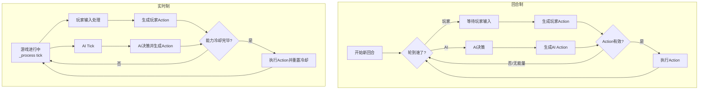

[&#8617; 返回总览](../README.md)

---

## 6. 行动与游戏循环系统 (Action & Game Loop System)

一个健壮的框架必须能够适应不同的游戏节奏。无论是传统的离散回合制，还是快节奏的实时战斗，其核心都是一套实体如何决定行动、何时行动以及如何执行行动的规则。本节将设计一个灵活的、可插拔的游戏循环框架，以及一个统一的行动抽象层。

### 6.1. 游戏循环策略 (Game Loop Strategies)

**RogueKit** 的核心设计之一是将游戏循环的具体实现与游戏逻辑解耦。这通过一个抽象的 `GameLoopManager` 来实现，开发者可以根据游戏类型选择或创建不同的循环策略。`GameManager` 将持有一个对当前循环管理器的引用，并委托其处理游戏进程。

*   **策略一：回合制循环 (`TurnBasedLoopManager`)**
    *   **适用场景**: 传统Roguelike，战棋游戏。
    *   **核心职责**: 维护一个包含所有可行动实体的行动顺序队列。
    *   **能量/行动点系统 (Energy/Action Point System)**: 为了处理不同行动的速度差异（例如，移动比攻击快），本库将实现一个基于能量的系统。
        *   每个实体每回合会获得一定量的能量（例如，100点）。
        *   每个行动（如移动、攻击）都有一个能量消耗值。
        *   实体可以持续行动，直到其能量不足以执行任何行动，此时其回合结束。
        *   行动队列将根据实体的速度属性（`Speed` Stat）或其他因素动态排序，速度快的实体将更频繁地获得行动机会。

*   **策略二：实时循环 (`RealTimeLoopManager`)**
    *   **适用场景**: 竞技场生存类（如《吸血鬼幸存者》），动作Roguelike。
    *   **核心职责**: 不依赖离散的回合，而是基于时间来管理行动的触发。
    *   **冷却系统 (Cooldown System)**: 实体（尤其是玩家）的行动不再受回合限制，而是受其能力的冷却时间（Cooldown）控制。`AbilityComponent` 将负责管理各个能力的冷却计时器。
    *   **自动触发**: 对于某些游戏类型，管理器可能需要周期性地（例如每0.5秒）为玩家自动触发主武器的行动。
    *   **AI Tick**: AI的决策不再是“轮到我了”，而是在每一物理帧或逻辑帧（`_process` 或 `_physics_process`）中被“Tick”，行为树（见第7节）会根据当前世界状态决定是否需要执行一个`Action`。

*   **策略三：混合模式循环 (`HybridTimeLoopManager`)**
    *   **适用场景**: 许多现代Roguelike游戏，如《死亡细胞》或《哈迪斯》，它们结合了实时自由移动和基于冷却或资源的动作执行。
    *   **核心职责**: 这种模式本质上是实时循环的变体，但增加了对游戏状态的精细控制。它允许游戏在大部分时间内以实时方式运行，但在特定事件（如玩家执行一个强力攻击）发生时，可以短暂地减慢全局时间（时间缩放）甚至进入“子弹时间”，以增强打击感或给玩家反应窗口。
    *   **实现**: `HybridTimeLoopManager`可以继承自`RealTimeLoopManager`，并额外提供如`slow_down_time(factor, duration)`等方法。它会监听特定的`Action`执行事件，当一个被标记为“高冲击力”的`Action`执行时，自动触发时间缩放效果。这展示了框架的可扩展性，允许开发者通过组合和继承现有策略来创造出更复杂和动态的游戏节奏。

下图总结了两种游戏循环策略的差异：

### 6.2. 命令模式：统一的 `Action` 抽象

无论游戏是回合制还是实时制，将“行动的意图”与“行动的执行”解耦都是一种最佳实践。这可以防止输入处理、AI决策和实际的角色能力执行代码紧密耦合。因此，我们将采用**命令（Command）设计模式**。玩家的输入或AI的决策不会直接调用移动或攻击函数，而是会创建一个`Action`对象。

*   **`BaseAction.gd` (extends `Object`)**: 所有行动的基类，至少包含一个`execute(owner: Node)`方法，其中`owner`是执行该行动的实体。根据游戏模式，它可能还包含`energy_cost`（回合制）或`cooldown`（实时制）等属性。
*   **具体行动类**: 例如 `MoveAction.gd`、`AttackAction.gd`、`UseAbilityAction.gd`。这些类将包含执行该行动所需的所有数据（如目标位置、攻击的目标实体、使用的能力数据）。

至关重要的是，`Action`对象的`execute()`方法本身不应包含复杂的执行逻辑。它扮演的是一个**委托者（Delegator）**的角色。`Action`对象会持有执行它所需的数据（如目标实体），并在其`execute()`方法中，调用行动发起者（`owner`）身上对应的组件来完成实际工作。例如，`MoveAction`的`execute()`会调用`owner`的`MovementComponent`上的一个方法，而`AttackAction`会调用`AbilityComponent`来执行一个攻击能力。这种设计进一步加强了系统的解耦，使得`Action`仅作为纯粹的意图封装，而具体的行为实现则由专门的组件负责。

*   **流程 (以回合制为例)**:
    1.  当轮到一个实体行动时，`TurnBasedLoopManager`会向该实体请求一个`Action`。
    2.  对于玩家，`PlayerInputComponent`会将输入（如按下方向键）转换为一个`MoveAction`对象。
    3.  对于AI，`AIComponent`会根据其逻辑决策并生成一个`Action`对象。
    4.  该`Action`对象被返回给循环管理器。
    5.  循环管理器检查实体是否有足够的能量执行该`Action`。
    6.  如果可以，循环管理器调用该`Action`的`execute(entity)`方法，该方法将**委托**给实体上的相应组件（如`MovementComponent`或`AbilityComponent`）来执行具体逻辑。
    7.  行动成功执行后，循环管理器扣除相应的能量。

这种设计使得添加新类型的行动变得非常容易，只需创建一个新的`Action`子类即可，无需修改循环管理器或实体本身的代码。它为两种游戏模式提供了统一的行动表达方式，是实现混合框架的关键。